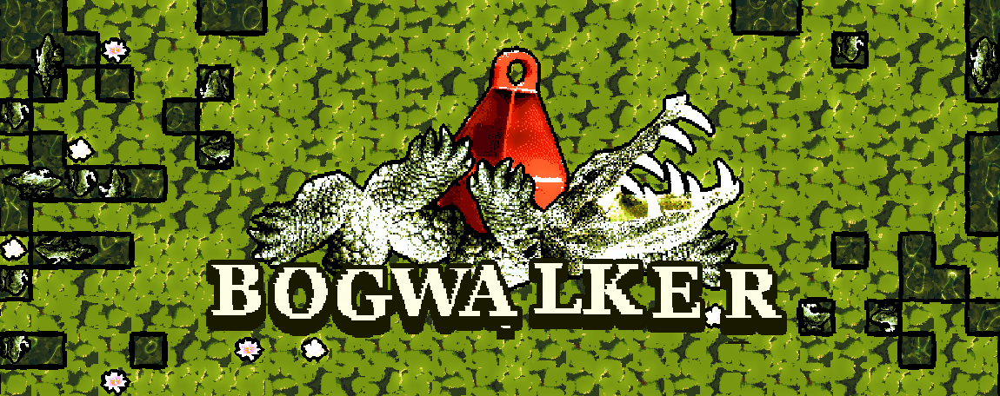

# What is Bogwalker?

Bogwalker is a logic puzzle game inspired by Minesweeper. You look at numbers laid across a swamp and try to figure out where the crocodiles lie.

# Guide

Reveal tiles by clicking on them. The numbers tell you how many crocodiles there are within a radius of 5 tiles. If you step on a crocodile, you die. Mark where you think the crocodiles are by placing buoys. When you place a buoy the threat of a crocodile that would be on that tile is subtracted from the threat field. Win by marking all the crocodiles.

# Ideas

 * Monsters liking certain depths. Perhaps you know the depth of every tile from the get-go and can determine what kinds of monsters it could have.

# Monster Codex

Krokul (the hybrid archetype) -- humanoid crocodile with a spear.
Ignesa (the ghost archetype) -- will-o-the-wisp, a flaming ghost with a woman's face. It's purpose is to misguide travelers.
Grendul (the beast archetype) -- Grendel, werewolf-looking beast.
Bordana (the witch archetype) -- Borda, a blindfolded witch. personifies fear of the swamp. creates fog.
Nokur (the shapeshifter archetype) -- Nixie, a shapeshifting water spirit, that looks like a worm/dragon.
Backa (the ? archetype) -- Brook Horse, a white horse.
Vondul (the elder archetype) -- Vodyanoy, old man, demands sacrifices.
Rusalka (the seductress archetype) -- a beautiful mermaid.
Durrul (the undead archetype) -- Dullahan, a headless man (on a horse), with a whip.
Bragul (the for archetype) -- Brollachan, a shapeless monster made of fog.
Moosul (the swamp thing archetype) -- Moosleute, a half-man, half-plant, covered in moss.
Rihtul (the burden archetype) -- Aufhocker, a goblin that jumps on your back and makes you heavier.
Trul (the giant archetype) -- Troll of the Tarn, a troll that has wondered down from the mountains and settled in the swamp.
